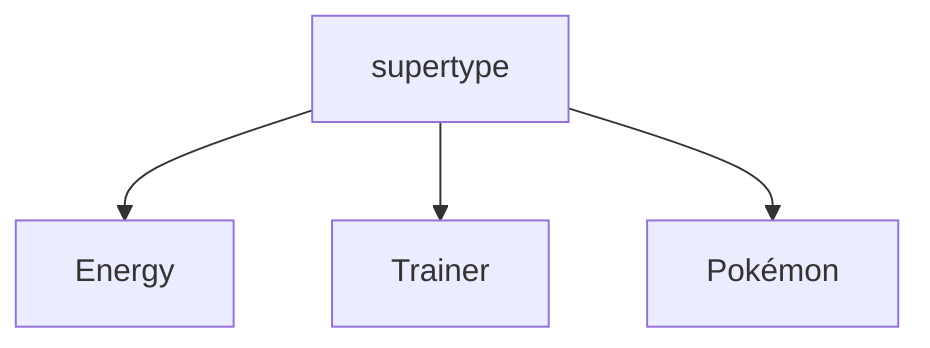
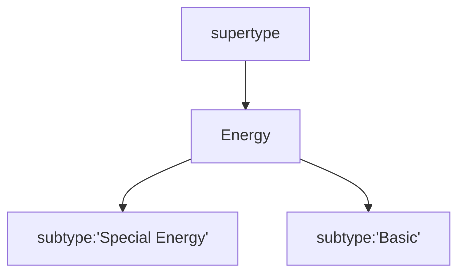
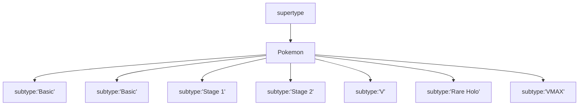
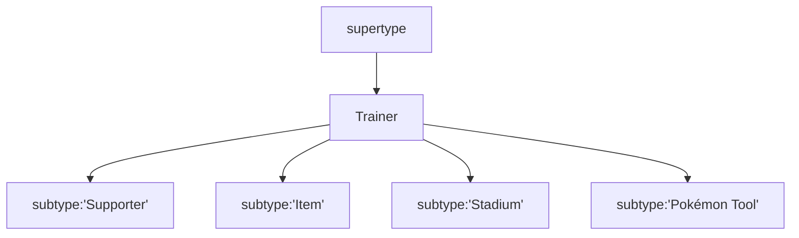

# Structure of JSON Db Cards

Lets look below at a basic card that we just loaded. Caterpie is a good example here. 

```JSON
{
    _id: ObjectId('5ebb41a6e2bd8efb1dacc45e'),
    id: 'swsh2-1',
    name: 'Caterpie',
    imageUrl: 'https://images.pokemontcg.io/swsh2/1.png',
    subtype: 'Basic',
    supertype: 'Pokémon',
    ability: {
        name: 'Adaptive Evolution',
        text: 'This Pokémon can evolve during your first turn or the turn you play it.',
        type: 'Ability'
    },
    hp: '50',
    retreatCost: [
        'Colorless'
    ],
    convertedRetreatCost: 1,
    number: '1',
    artist: 'Uta',
    rarity: 'Common',
    series: 'Sword & Shield',
    set: 'Rebel Clash',
    setCode: 'swsh2',
    types: [
        'Grass'
    ],
    attacks: [
        {
            name: 'Gnaw',
            cost: [
                'Colorless'
            ],
            convertedEnergyCost: 1,
            damage: '10',
            text: ''
        }
    ],
    weaknesses: [
        {
            type: 'Fire',
            value: '×2'
        }
    ],
    imageUrlHiRes: 'https://images.pokemontcg.io/swsh2/1_hires.png',
    nationalPokedexNumber: 10,
    evolvesTo: [
        'Metapod'
    ]
}
```
# Card Structures
## Pokemon Card Structure
This is about the most we care about in the card structures for our needs. There's a lot of good info in here, but for our simulations we just need these things. 

|  element | struct | type |
|---|---|---|
| _id  | ObjectId  |ObjectId('5ebb41a6e2bd8efb1dacc45e') |
|  id | Card Set   | string  |
|  imageUrl | url for image from pokemontcg.io  | string  |
| subtype | 'Basic', 'Grass', etc | string |
| ability | ability description {'name','text','type'} | dict |
| hp | amount | string |
| convertedRetreatCost | number of energy | int |
| types| types 'Grass' | array[Strings] |
| attacks | array of dictionary explaining attacks | array[dict{}] |
| weaknesses | array of dictionary explaining weakness | array[dict{}] |
| evolvesTo | array of strings for next evolutoin | array[string] |

## Trainer Card Stucture
Trainer types seem to do what we expect

|  element | struct | type |
|---|---|---|
| _id  | ObjectId  |ObjectId('5ebb41a6e2bd8efb1dacc45e') |
|  id | Card Set   | string  |
| name | Name of card | string |
|  imageUrl | url for image from pokemontcg.io  | string  |
| subtype | 'Supporter','Item','Stadium','Pokémon Tool' | string |
| supertype | 'Trainer' | string | 
| text | Array of text explaining the card | array[String]|

## Energy Card Structures
There only seems to be json types for special energy in this data set. We'll have to assume that we must make a few base types. 


|  element | struct | type |
|---|---|---|
| _id  | ObjectId  |ObjectId('5ebb41a6e2bd8efb1dacc45e') |
|  id | Card Set   | string  |
| name | Name of card | string |
|  imageUrl | url for image from pokemontcg.io  | string  |
| subtype | 'Special' | string |
| supertype | 'Enery' | string | 
| text | Array of text explaining the card | array[String]|


## Strcture graph
Were looking at the super and sub types here for 3 classes of cards: Pokemon, Energy, and Trainer cards.



Below is the breakdown of super types and their sub types options. This is not a graph of how these will work together, but how they're laid out in the database

## Energy


### Pokemon

### Trainer



